# 🛒 Smart Department Store POS System

<div align="center">

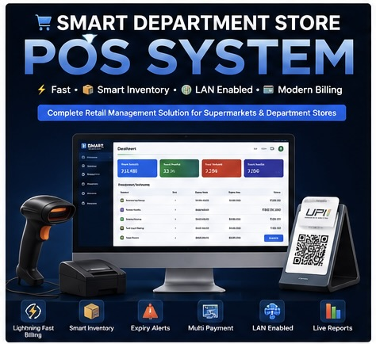

### ⚡ Fast • 📦 Smart Inventory • 🌐 LAN Enabled • 💳 Modern Billing

A modern enterprise-grade POS system built for supermarkets, department stores, and retail businesses.

[]()
[]()
[]()
[]()

</div>

---

# 🚀 Overview

A fully custom-built retail management platform designed to simplify real-world billing and inventory operations.

Built for:

- 🏪 Supermarkets
- 🛍️ Department Stores
- 🧾 Retail Shops
- 💼 Multi-counter billing environments

The system focuses on:

- ⚡ Speed
- 📦 Inventory accuracy
- 🔒 Secure access
- 🌐 LAN-based scalability
- 🧠 Real retail workflows

---

# 🎥 Product Showcase

<div align="center">


</div>

> Add a demo GIF here showing:
>
> - Barcode scanning
> - Fast billing
> - UPI payments
> - Inventory updates
> - Receipt printing
> - Analytics dashboard

---

# ✨ Core Features

# 🧾 Advanced Billing Engine

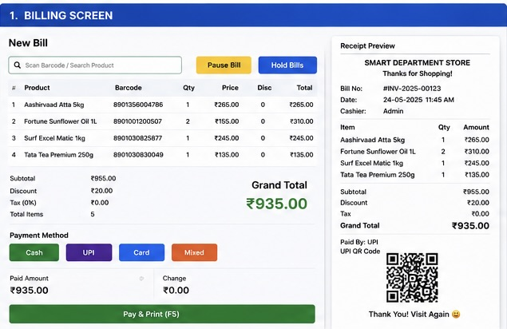

Modern billing workflow with:

- ⚡ Lightning-fast barcode scanning
- 🔄 Multi-bill sessions
- ⏸️ Pause & resume billing
- 🖨️ Thermal receipt preview
- 💳 Split payments
- 📱 Auto-generated UPI QR codes

---

# 📦 Smart Inventory System

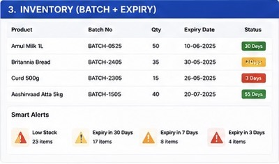

Inventory management built for real retail environments.

### Features

- 🔁 FIFO stock deduction
- 📅 Batch-wise expiry tracking
- 🚨 Low stock alerts
- ⚠️ Expiry notifications
- 📦 Batch management
- 🛑 Damaged goods handling

---

# 📊 Analytics Dashboard

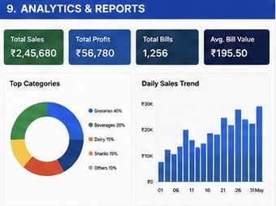

Gain real-time business insights.

### Dashboard Features

- 📈 Sales analytics
- 💰 Profit tracking
- 🧾 Billing reports
- 🗂️ Category performance
- 📉 Revenue trends

---

# 👥 Customer Loyalty System

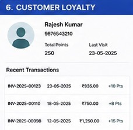

Customer relationship management features:

- 📞 Phone-based customer tracking
- 🎁 Loyalty points system
- 📅 Last visit history
- 💰 Purchase tracking

---

# 🚚 Suppliers & Purchases

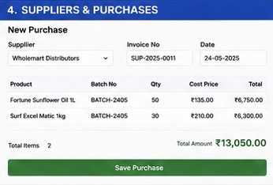

Efficient supplier and purchase management.

### Includes

- 📦 Batch creation
- 🏢 Supplier tracking
- 🔄 Automatic stock updates
- 📄 Purchase management

---

# 🔁 Returns Management

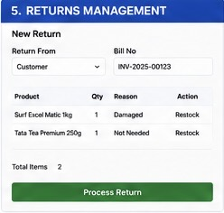

Flexible customer return workflow.

### Features

- ↩️ Process customer returns
- 📦 Restock returned products
- ⚠️ Mark damaged goods
- 🧾 Return history tracking

---

# 🔐 Role-Based Access Control

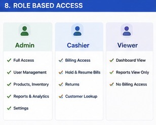

Secure role-based permissions system.

### Roles

## 👑 Admin
- Full system access
- User management
- Inventory management
- Reports & analytics

## 🧾 Cashier
- Billing access
- Customer lookup
- Limited permissions

## 👁️ Viewer
- Dashboard access
- Reports viewing

---

# 💳 Multiple Payment Options

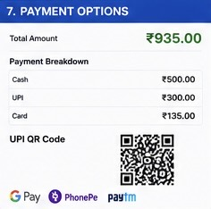

Supports:

- 💵 Cash
- 📱 UPI
- 💳 Card
- 🔀 Mixed payments

Auto-generated UPI QR codes with bill amount included.

---

# 🖨️ Thermal Receipt Preview

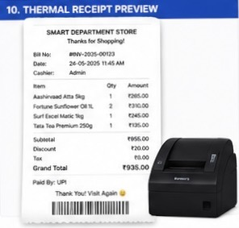

Real-time printable receipt generation with:

- 🧾 Itemized billing
- 💰 Payment breakdown
- 📱 QR payment support
- 🖨️ Thermal printer optimization

---

# 🌐 LAN-Based Architecture

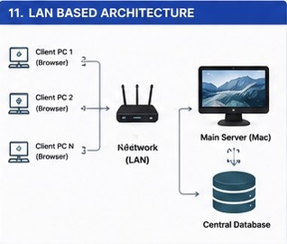

Built for local retail networks.

### Architecture Flow

```text
Client PCs → Local Network → Main Server → Central Database
```

### Benefits

- 🌐 Browser-based access
- ⚡ No installation on client PCs
- 🔄 Centralized management
- 🚀 Easy scaling across counters

---

# 🎯 Key Highlights

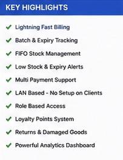

- ⚡ Lightning-fast billing
- 📦 Smart inventory tracking
- 🔐 Secure role management
- 💳 Multi-payment support
- 🌐 LAN-enabled system
- 📈 Analytics dashboard
- 🧾 Thermal receipt support
- 🔄 Returns & damaged goods handling

---

# 🛠️ Tech Stack

## Frontend
- HTML
- CSS
- JavaScript

## Backend
- Node.js
- Express.js

## Database
- MongoDB / SQL

## Process Management
- PM2

---

# 🧠 Future Enhancements

- 📲 Mobile App Integration
- ☁️ Cloud Backup
- 🧾 GST Reports
- 💬 WhatsApp Bill Sharing
- 📡 Offline Mode
- 🤖 AI Inventory Prediction

---

# 🏗️ System Design Mindset

Designed with real-world production usage in mind.

### Focus Areas

- ⚡ High-speed billing
- 📦 Inventory accuracy
- 🔄 Reliable synchronization
- 🌐 LAN scalability
- 🔒 Secure access control

---

# 📌 Public Showcase Note

This repository is a public showcase version.

Core production logic, business rules, and sensitive infrastructure remain private.

---

# ❤️ Built For Real Shops

Designed to solve real retail problems with speed, simplicity, and reliability.

---

<div align="center">

## ⭐ If you like this project, consider giving it a star ⭐

</div>